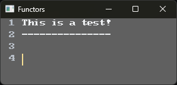

# **Functors**

**Functors** is the Rust-based evolution of the original **Functor** editor — a hybrid environment for coding, thinking, exploring, and automating.  
It blends a deterministic MVU editor core with reactive notebook cells, multi‑language execution, HTML-based visualization, and agentic workflows powered by Copilot or local LLMs.

Functors is designed to be:

- **A code editor** — fast, GPU‑accelerated, MVU‑driven  
- **A notebook** — reactive cells with HTML output  
- **An agentic workspace** — integrate Copilot or local models  
- **A multi-language environment** — Rust, Python, Lua, WASM and more  
- **A project workspace** — folder‑based structure with plugins for language support  

The goal is to create a unified space where code, ideas, visualizations, and agents coexist seamlessly.

## Status

Functors is currently in early exploration and design.  
Architecture documents, prototypes, and subsystem plans are being developed in the `docs/` folder.

## Screenshots

## Goals

- Deterministic MVU rendering engine  
- Reactive cell system with HTML output  
- Multi-language execution layer  
- Agent integration (Copilot + local LLMs)  
- Workspace and plugin ecosystem  
- A cohesive, narrative-friendly environment for programming and exploration  

## License

BSD-2-Clause
